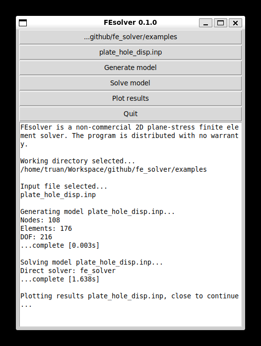
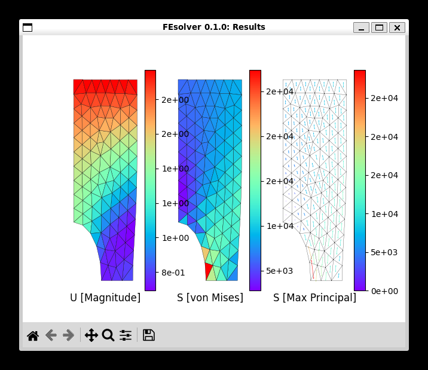
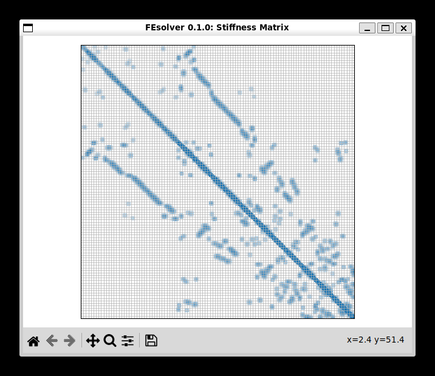

# FEsolver

A 2D plane-stress finite element analysis solver written in Python. Models are defined
using `.inp` text files in a format similar to Simulia Abaqus, making it accessible to
anyone familiar with commercial FEA software.

FEsolver is intended as a learning tool — the codebase is structured to reflect the
theoretical steps of the finite element process, and the documentation explains the
theory behind each step.

---

## Requirements

- Python >= 3.11

---

## Installation

Clone the repository:

```bash
git clone https://github.com/truanwillis/fe_solver.git
cd fe_solver
```

Install the project and its dependencies:

```bash
pip install -e ".[dev]"
```

---

## Usage

Run the application:

```bash
python main.py
```

Example `.inp` files are provided in `examples/`.

### Configuration

On first run, a `config_user.json` file is automatically created in the project root
with the following default settings:

| Option | Type | Default | Description |
|---|---|---|---|
| `print_head` | boolean | `true` | Prints the pandas head for stress results in the terminal |
| `save_matrix` | boolean | `true` | Saves the global stiffness matrix to `stiffness_matrix.csv` |
| `fe_solver` | boolean | `true` | Uses the FEsolver implementation; `false` defaults to numpy |
| `scale` | integer | `2` | Deformation scale factor for result plots |

Edit `config_user.json` directly to change these settings between runs.

### GUI



The GUI provides the following options:

- **Working directory** — sets the working directory for input and output files
- **Input file** — select a model `.inp` file
- **Generate model** — parses the input file and builds the model object
- **Solve model** — runs the finite element solver
- **Plot results** — displays displacement, von Mises stress, and principal stress on
  the deformed mesh. If `save_matrix` is `true`, also plots the stiffness matrix heatmap
- **Quit** — closes the application

### Results

FEsolver plots displacement, von Mises stress, and principal stress on the deformed mesh.



If `save_matrix` is `true` in `config_user.json`, the global stiffness matrix is also
visualised as a heatmap. The sparsity pattern reflects the mesh connectivity — nodes
that share an element appear as non-zero blocks.



---

## Running Tests

```bash
pytest
```

---

## Documentation

- [Keyword Reference](docs/keywords.md) — full reference for `.inp` file keywords
- [FEA Theory](docs/theory.md) — explanation of the finite element method as implemented in FEsolver
- [Roadmap](docs/ROADMAP.md) — planned direction and phasing
- [Work Items](docs/TODO.md) — known issues and open work

---

## Technologies

- [Python](https://www.python.org/) 3.11+
- [NumPy](https://numpy.org/) — matrix operations and linear algebra
- [Pandas](https://pandas.pydata.org/) — matrix and results storage
- [Matplotlib](https://matplotlib.org/) — results plotting
- [Tabulate](https://github.com/astanin/python-tabulate) — terminal reporting

---

## License

MIT License.

---

## Author

Truan Willis
