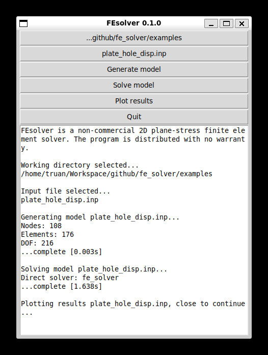
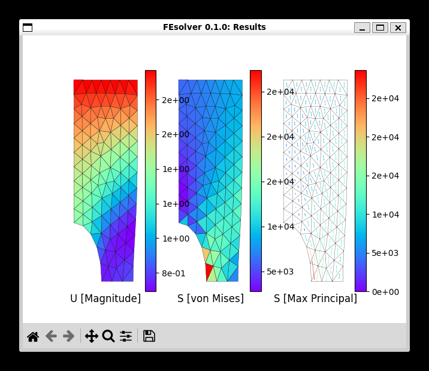
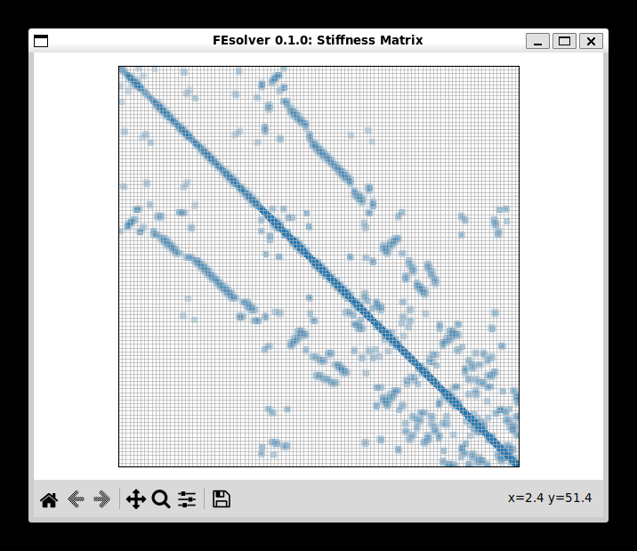

# FEsolver

A 2D plane-stress finite element analysis (FEA) solver written in Python. You define
models in `.inp` text files, using a format similar to Abaqus. If you have used commercial
FEA software, the input will look familiar.

FEsolver is a learning tool. The code follows the steps of the finite element process in
order, and the documentation explains the theory behind each step.

---

## Requirements

- Python 3.11 or later

---

## Installation

Clone the repository:

```bash
git clone https://github.com/truanwillis/fe_solver.git
cd fe_solver
```

Install the project and its dependencies:

```bash
pip install -e ".[dev]"
```

---

## Usage

Run the application:

```bash
python main.py
```

There are example `.inp` files in `examples/`. If you are new to the tool, start with
`examples/worked_example.inp`. [docs/worked_example.md](docs/worked_example.md) works
through its full solution one calculation at a time.

### Configuration

The first time you run FEsolver, it creates `config_user.json` in the project root with
these default settings:

| Option | Type | Default | Description |
|---|---|---|---|
| `print_head` | boolean | `true` | Prints the pandas head for stress results in the terminal |
| `save_matrix` | boolean | `true` | Saves `outputs/stiffness_matrix.csv` in the working directory, showing which elements contribute to each entry of the global stiffness matrix. Also turns on the stiffness matrix heatmap |
| `fe_solver` | boolean | `true` | Uses the FEsolver implementation. `false` uses numpy instead |
| `scale` | integer | `2` | Deformation scale factor for result plots |

To change a setting, edit `config_user.json` before you run FEsolver.

### GUI



The GUI has these buttons:

- **Working directory**: sets the working directory for input and output files
- **Input file**: selects a model `.inp` file
- **Generate model**: reads the input file and builds the model
- **Solve model**: runs the finite element solver
- **Plot results**: plots displacement, von Mises stress and principal stress on the
  deformed mesh, and the stiffness matrix heatmap if `save_matrix` is `true`
- **Quit**: closes the application

### Results

FEsolver plots displacement, von Mises stress and principal stress on the deformed mesh.



If `save_matrix` is `true` in `config_user.json`, FEsolver also plots the global stiffness
matrix as a heatmap. Nodes that share an element show as non-zero blocks.



---

## Running tests

```bash
pytest
```

---

## Documentation

The documentation is published at <https://truanwillis.github.io/fe_solver/>.

### Learning the method

- [Theory and process](docs/theory.md): what FEsolver does at each step and why, from the
  governing partial differential equations to stress recovery
- [Worked example](docs/worked_example.md): a 2-element model solved by hand, from input
  file to stresses, with every calculation shown

### Reference

- [Keywords](docs/keywords.md): the `.inp` keywords FEsolver reads
- [Data structures](docs/data_structures.md): how the code stores a model, from parsed
  input to results

### Project

- [Roadmap](docs/roadmap.md): planned direction and phases
- [Work items](docs/todo.md): known issues and open work

---

## Technologies

- [Python](https://www.python.org/) 3.11 or later
- [NumPy](https://numpy.org/): matrix operations and linear algebra
- [Pandas](https://pandas.pydata.org/): matrix and results storage
- [Matplotlib](https://matplotlib.org/): results plotting
- [Tabulate](https://github.com/astanin/python-tabulate): terminal output

---

## Licence

[MIT License](https://github.com/TruanWillis/fe_solver/blob/main/LICENSE).

---

## Author

Truan Willis
